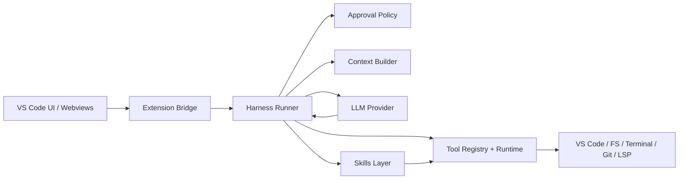

# Harness Migration Plan 

## Goal

Implement a Claude-Code-style agent harness inside PocketAI while keeping the current UI and overall feel largely unchanged.

The main shift should be architectural, not visual:

- keep the current chat panel, approvals, inline diffs, endpoint switching, and session UX
- replace the ad hoc orchestration with a cleaner harness/runtime model
- make the harness reusable across Local PocketAI, Codex Bridge, and future providers

## Provenance And Safety Rules

This part is non-negotiable.

- We may reuse or adapt open `claw-code` code where the license allows it.
- We may use public behavior, public docs, and our own observations as product requirements.
- We should not copy leaked Claude Code source, prompts, tests, strings, schemas, or internal architecture directly.
- If a Claude Code behavior is desirable, we should rewrite it as a clean-room requirement and implement it ourselves.
- We should not use the leaked repository as a source-level implementation reference, even if it is easy to find. At most, it can inform black-box parity goals that we restate in our own words.
- Every migrated subsystem should note its provenance in the PR description:
  - `ported from open claw-code`
  - `adapted from existing PocketAI`
  - `new clean-room implementation`

Reference priority:

1. existing PocketAI code
2. open `claw-code`
3. public product behavior and docs
4. our own clean-room design

## Behavioral Parity Priorities

These are the highest-value areas for matching the Claude-Code-like feel without copying proprietary source:

1. Tool registry and permission model
2. Agent loop / turn runner / reasoning flow
3. Skills layer
4. Native IDE bridge, inline diffs, and slash orchestration
5. Reliability, memory, compaction, and long-task recovery

## Current PocketAI Starting Point

PocketAI already has many of the needed harness pieces. The work is mostly to normalize and harden them.

- Tool loop: `src/tool-loop.ts`
- Tool registry / schemas: `src/tool-definitions.ts`
- Tool execution and safety checks: `src/tool-executor.ts`
- Extension orchestration: `src/extension.ts`
- Chat/session message routing: `src/message-handler.ts`
- Session persistence: `src/session-manager.ts`
- Checkpoints and rewind: `src/checkpoints.ts`
- Inline diffs: `src/inline-diff.ts`
- Terminal execution: `src/terminal-manager.ts`
- Permissions and hooks: `src/permissions.ts`, `src/hooks.ts`
- Memory/context/compaction: `src/memory-manager.ts`, `src/workspace-context.ts`
- Slash command entrypoint: `src/slash-commands.ts`

## Target Harness Outcomes

By the end, the harness should provide:

- a first-class tool registry with stable schemas, permission hooks, and rich structured results
- a deterministic turn state machine
- a first-class approval model instead of scattered mode checks
- a canonical tool runtime with shared validation and result envelopes
- a reusable skills layer for higher-level workflows
- better native IDE awareness, including LSP-style code intelligence hooks
- consistent background task handling
- better loop detection and retry behavior
- cleaner provider integration for Local PocketAI and Codex Bridge
- minimal UI churn

## Proposed Architecture

Create a dedicated harness layer under `src/harness/` and move orchestration into it.

Suggested modules:

- `src/harness/tools/`
  - canonical tool registry, schemas, discovery, and per-tool adapters
- `src/harness/types.ts`
  - canonical event, turn, approval, and task types
- `src/harness/runner.ts`
  - main turn runner / state machine
- `src/harness/policy.ts`
  - ask/auto/plan approval decisions
- `src/harness/runtime.ts`
  - executes tool calls through a common contract
- `src/harness/provider.ts`
  - provider abstraction for model backends
- `src/harness/events.ts`
  - event emission utilities for UI/state syncing
- `src/harness/skills/`
  - skill loading, discovery, and invocation

High-level shape:

PocketAI UI should consume harness state/events rather than piecemeal side effects.

## Workstreams

### 1. Define The Tool Registry And Permission Contract

Start here, because this is the biggest contributor to perceived intelligence.

Required metadata for each tool:

- stable unique name
- natural-language description written for the model
- JSON-schema-like parameter definition
- execute handler
- permission hook
- risk classification
- structured result formatter

Critical first-wave tools:

- `read_file`
- `edit_file`
- `write_file`
- `grep`
- `glob`
- `run_command` / `execute_shell`
- git inspection tools
- LSP-style IDE tools such as definitions, references, diagnostics
- a tool-discovery helper such as `list_tools` or equivalent registry introspection

Acceptance criteria:

- tools are model-facing assets, not just executor cases
- every tool can explain whether it is safe in ask/auto/plan
- results are structured enough for the next turn to consume without brittle parsing

### 2. Define The Harness Contract

First write down the lifecycle we want.

Core event types should include:

- `turn_started`
- `assistant_delta`
- `assistant_message_completed`
- `tool_calls_detected`
- `tool_call_pending_approval`
- `tool_call_started`
- `tool_call_completed`
- `tool_call_failed`
- `diff_ready`
- `background_task_updated`
- `turn_completed`
- `turn_failed`

Acceptance criteria:

- one turn has a single source of truth
- transcript updates become an output of the harness, not the orchestration mechanism itself

### 3. Extract The Current Tool Loop Into A Runner

Refactor `src/tool-loop.ts` into a harness runner without changing behavior first.

Plan:

- move loop control, retries, and loop detection into `HarnessRunner`
- keep current tools and current UI behavior intact during the extraction
- preserve both structured and text-based tool paths for now

Acceptance criteria:

- existing chats still work
- current approvals and inline diffs still appear
- no visible UI redesign is required

### 4. Normalize Tool Calls Behind A Runtime Interface

Convert tools into a shared runtime model instead of having execution logic spread across the loop and executor.

Each tool adapter should expose:

- `validate`
- `preview`
- `execute`
- `classifyRisk`
- `formatResult`

Preserve existing PocketAI safeguards:

- read-before-edit enforcement
- workspace path restrictions
- permission rules
- checkpoints before file mutations
- lifecycle hooks
- diff preview generation for edit operations
- shell command safety checks and destructive-command warnings

Acceptance criteria:

- all built-in tools run through one runtime path
- tool failures return normalized error objects

### 5. Move Ask / Auto / Plan Into Policy

Right now, mode behavior is mixed into execution flow. Move it into a policy layer.

The policy layer should answer:

- does this tool require approval?
- can this tool auto-run?
- should this tool be blocked in plan mode?
- should a diff preview be generated before approval?

Acceptance criteria:

- `Ask`, `Auto`, and `Plan` work exactly as they do now from the user’s perspective
- mode-specific logic is no longer scattered across loop and executor code

### 6. Add A Skills System

Add a reusable workflow layer on top of raw tools.

Suggested shape:

- bundled built-in skills for common engineering workflows
- workspace-local skills under a dedicated directory such as `.pocketai/skills/`
- a `run_skill` tool or equivalent harness-native skill invocation path
- skill discovery so the agent can find relevant workflows instead of reinventing them

Good first skills:

- implement feature following local style
- refactor function with tests
- debug failing command or stack trace
- add documentation for changed code

Acceptance criteria:

- skills are composable and parameterized
- skills can call tools without bypassing the same safety model
- the model can discover available skills naturally

### 7. Make Pending Changes A First-Class Harness Artifact

Keep the current inline diff UI, but stop treating pending edits as incidental tool metadata.

Represent them directly as:

- pending file mutation
- diff preview
- approval status
- applied / rejected / stale state

Acceptance criteria:

- existing inline diff UI remains
- the backing state becomes explicit and easier to reason about

### 8. Add A Native IDE Bridge Layer

Keep the UI looking the same, but make the harness treat IDE capabilities as first-class operations.

This layer should support:

- open file in editor
- reveal range / selection
- diagnostics and problems access
- definitions / references / symbol discovery
- apply edit with preview
- VS Code command invocation where appropriate
- slash command routing for `/plan`, `/skills`, `/doctor`, `/compact`, `/tasks`, and similar harness-native actions

Acceptance criteria:

- IDE-specific actions do not live as scattered extension helpers
- slash commands become harness-aware rather than ad hoc command branches

### 9. Unify Foreground And Background Command Execution

The harness should treat commands as tracked tasks, not just tool results.

Add:

- task IDs
- lifecycle state
- stdout/stderr snapshots
- cancellation support
- reconnect-safe status if the webview refreshes

Acceptance criteria:

- long-running tasks survive panel refreshes better
- the model receives consistent command result summaries

### 10. Add A Provider Abstraction

The harness should not know whether it is talking to Local PocketAI or Codex Bridge.

Define a provider contract for:

- plain streaming completions
- structured tool support
- reasoning/model metadata
- provider capability flags

Short-term rule:

- Local PocketAI keeps the full current tool harness
- Codex Bridge remains partially capability-gated until it supports approval-compatible tool flows

Acceptance criteria:

- provider-specific branching is isolated
- UI keeps the same endpoint and per-chat model UX

### 11. Fold Memory, Context, And Compaction Into Lifecycle Hooks

Move these out of scattered orchestration code and into explicit harness stages:

- pre-turn context assembly
- pre-tool safety/context refresh if needed
- post-turn summarization
- periodic compaction
- checkpoint registration

Context sources should include:

- workspace file tree and active editor state
- git status and recent changes
- diagnostics
- project instructions from `.pocketai.md`
- compatibility readers for `AGENTS.md` or `CLAUDE.md` when present, treated as user/project guidance rather than proprietary product artifacts

Acceptance criteria:

- less logic living directly in `extension.ts`
- context behavior remains stable across providers

### 12. Testing And Regression Harness

Before broadening behavior, add a proper test matrix.

Test categories:

- tool approval decisions
- loop detection
- retry handling
- read-before-edit enforcement
- pending diff lifecycle
- background command lifecycle
- provider capability branching
- session restore after refresh

Add fixture-based integration tests for:

- read -> edit -> approve -> continue
- command -> output -> follow-up tool call
- rejection flow
- codex endpoint with reasoning/model switching
- skill invocation and chained tool execution
- IDE bridge operations such as diagnostics and open-file actions

## Suggested Delivery Order

### Phase 0: Spec And Guardrails

- write a short harness spec
- write a provenance checklist
- decide which `claw-code` modules can be reused directly
- add an experimental feature flag, for example `pocketai.experimentalHarness`
- define the first-wave tool registry contract

### Phase 1: Non-Visual Extraction

- extract runner, policy, and runtime modules
- keep UI behavior identical
- keep current state shape if possible, with adapters
- move existing tools behind the new registry without changing their user-facing behavior

### Phase 2: Tool Registry And Policy Hardening

- finish first-wave tool definitions and structured results
- centralize ask/auto/plan approval behavior
- preserve current safeguards for file edits and commands

### Phase 3: Approval And Diff Normalization

- make pending changes explicit
- route inline diff UI through harness state

### Phase 4: Skills And IDE Bridge

- add the initial skills layer
- add native IDE and slash-command harness routing
- add LSP-backed code intelligence tools

### Phase 5: Command / Task Runtime

- unify background tasks
- improve cancellation and reconnect behavior

### Phase 6: Provider Normalization

- isolate Local PocketAI and Codex Bridge behind a common interface
- keep Codex capability-limited where needed

### Phase 7: Cleanup

- remove dead orchestration paths
- document the harness
- turn the new path on by default after regression coverage

## Risks

### 1. UI Regressions From State Migration

Risk:

- changing transcript and tool state flow could break the current panel behavior

Mitigation:

- keep the current UI components
- add adapters so the webview can continue consuming familiar state until the harness stabilizes

### 2. Duplicate State During Migration

Risk:

- transcript state and harness state drift

Mitigation:

- keep one canonical harness state object
- generate transcript/webview payloads from it

### 3. Codex Bridge Capability Mismatch

Risk:

- Codex does not yet support the same approval/diff flow as the local harness

Mitigation:

- capability-gate Codex features
- avoid pretending Codex has parity until the bridge truly supports it

### 4. Provenance Contamination

Risk:

- accidental copying from proprietary leaked material

Mitigation:

- do not paste from leaked source
- do not use leaked repos as implementation references
- treat Claude Code only as a black-box behavior target
- document provenance on every PR

### 5. Security Regressions

Risk:

- runtime refactors weaken path, command, or permission boundaries

Mitigation:

- preserve existing guardrails first
- add tests before widening any tool capabilities

## What We Should Reuse Directly

Good candidates to preserve or port with minimal changes:

- current tool schemas and descriptions
- checkpoint system
- inline diff manager
- terminal manager
- permission rules
- lifecycle hooks
- session persistence
- existing slash commands where the semantics already fit the new harness

These are already aligned with the kind of harness we want.

## What We Should Rebuild Cleanly

These deserve a cleaner pass instead of more patching:

- turn orchestration
- approval policy
- tool execution state model
- background task lifecycle
- skills storage and invocation model
- IDE bridge abstraction
- provider abstraction
- event/state synchronization between extension host and webview

## Deliverables

- `plan.md` in repo root
- harness architecture spec
- provenance checklist
- experimental harness flag
- first-wave tool inventory and risk classification
- phased PR series instead of one giant rewrite

## First Implementation Slice

The safest first slice is:

1. create `src/harness/types.ts`, `src/harness/policy.ts`, and `src/harness/runner.ts`
2. create a minimal `src/harness/tools/registry.ts` that wraps the current built-in tools
3. move the current `tool-loop.ts` logic into the runner with minimal behavior change
4. keep existing UI and transcript payloads
5. add tests for ask/auto/plan, loop detection, and one edit approval flow

If that slice lands cleanly, the rest of the migration becomes much lower risk.
